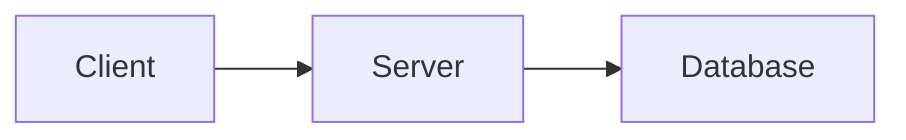

# Documentation Guidelines

Standards and patterns for writing Agent Memory documentation.

## Principles

1. **Accuracy over completeness** - Wrong documentation is worse than missing documentation
2. **Show, don't tell** - Use examples liberally
3. **One concept per section** - Keep sections focused
4. **Link, don't repeat** - Reference other docs instead of duplicating

---

## Diátaxis Framework

All documentation follows the [Diátaxis framework](https://diataxis.fr/):

| Type            | Purpose       | Style                 | Location            |
| --------------- | ------------- | --------------------- | ------------------- |
| **Tutorial**    | Learning      | "Let's do X together" | `docs/tutorials/`   |
| **Guide**       | Accomplishing | "How to do X"         | `docs/guides/`      |
| **Reference**   | Information   | "X is Y"              | `docs/reference/`   |
| **Explanation** | Understanding | "X works because..."  | `docs/explanation/` |

### When to Use Each

| User Question                | Document Type |
| ---------------------------- | ------------- |
| "I'm new, teach me"          | Tutorial      |
| "How do I accomplish X?"     | Guide         |
| "What are all the options?"  | Reference     |
| "Why does it work this way?" | Explanation   |

---

## File Structure

### Naming Conventions

```
# Files
lowercase-with-dashes.md   ✓
camelCase.md               ✗
snake_case.md              ✗

# Directories
guides/platform/           ✓ (lowercase)
Guides/Platform/           ✗
```

### Required Sections by Type

**Tutorial:**

```markdown
# Title

One-sentence description.

**What you'll learn:** Bullet list
**Prerequisites:** What's needed before starting
**Time:** Estimated duration

---

## Step 1: First Step

...

## Step N: Final Step

...

---

## Next Steps

- [Link](path) - Description
```

**Guide:**

```markdown
# Title

One-sentence description of what this guide helps you accomplish.

## Prerequisites (if applicable)

- Requirement 1
- Requirement 2

---

## Section 1

...

---

## Troubleshooting (if applicable)

### Common Issue

**Cause:** ...
**Fix:** ...

---

## See Also

- [Link](path) - Description
```

**Reference:**

```markdown
# Title

Brief description of what this reference covers.

## Section 1

| Parameter | Type   | Required | Description |
| --------- | ------ | -------- | ----------- |
| `name`    | string | Yes      | ...         |

---

## See Also

- [Link](path) - Description
```

**Explanation:**

```markdown
# Title

Opening paragraph explaining the concept at a high level.

---

## Section 1

Detailed explanation with diagrams if helpful.

---

## See Also

- [Link](path) - Related concepts
```

---

## Writing Style

### Voice and Tone

- Use **second person** ("you") for instructions
- Use **active voice** ("Run the command" not "The command should be run")
- Be **direct** and concise
- Avoid jargon; define terms on first use

### Formatting

**Headings:**

```markdown
# Document Title (H1) - One per document

## Major Section (H2)

### Subsection (H3)
```

**Code blocks:**

````markdown
```bash
# Shell commands
agent-memory mcp
```

```json
{
  "action": "create",
  "name": "example"
}
```

```typescript
// TypeScript examples
const result = await service.query();
```
````

**Inline code:**

```markdown
Use `memory_query` with action `context`.
Set `AGENT_MEMORY_DEBUG=true` to enable.
```

**Tables:**

```markdown
| Column 1 | Column 2 | Column 3 |
| -------- | -------- | -------- |
| Value 1  | Value 2  | Value 3  |
```

**Lists:**

```markdown
Unordered (options, features):

- Item 1
- Item 2

Ordered (steps, sequences):

1. First step
2. Second step

Definition-style:

- **Term** - Definition
- **Term** - Definition
```

### MCP Tool Documentation

When documenting MCP tools, use this format:

````markdown
### `tool_name`

Brief description of what this tool does.

**Actions:** `action1`, `action2`, `action3`

| Parameter | Type   | Required | Description       |
| --------- | ------ | -------- | ----------------- |
| `action`  | string | Yes      | Action to perform |
| `param1`  | string | No       | Description       |

**Example:**

```json
{
  "action": "action1",
  "param1": "value"
}
```
````

**Tool:** `tool_name`

````

### Environment Variables

```markdown
| Variable | Default | Description |
|----------|---------|-------------|
| `AGENT_MEMORY_VAR_NAME` | `default` | Description of what this controls. |
````

### CLI Commands

````markdown
### command-name

Description of what this command does.

```bash
agent-memory command-name [options]
```
````

**Options:**
| Option | Short | Description |
|--------|-------|-------------|
| `--option` | `-o` | What this option does |

**Example:**

```bash
agent-memory command-name --option value
```

````

---

## Cross-References

### Internal Links

Use relative paths from the current file:

```markdown
# From docs/tutorials/quickstart.md
[IDE Setup](../guides/ide-setup.md)
[MCP Tools](../reference/mcp-tools.md)
````

### Link Style

```markdown
# Inline (preferred for flow)

See [IDE Setup](../guides/ide-setup.md) for configuration details.

# Reference list (for "See Also" sections)

- [IDE Setup](../guides/ide-setup.md) - Configure your IDE
- [PostgreSQL Setup](../guides/postgresql-setup.md) - Enterprise database
```

### Avoiding Broken Links

Before committing, verify links:

```bash
# Find all markdown links
grep -r '\[.*\](.*\.md)' docs/

# Check for common broken patterns
grep -r 'hooks-enforcement' docs/  # Should be hooks.md
grep -r 'performance-tuning' docs/  # Should be performance.md
```

---

## Auto-Generated Content

Some documentation is auto-generated. Do not edit between markers:

```markdown
<!-- AUTO-GENERATED:SECTION-START -->

This content is auto-generated.
Do not edit manually.

<!-- AUTO-GENERATED:SECTION-END -->
```

### Auto-Generated Files

| File                                    | Generator       | Command                     |
| --------------------------------------- | --------------- | --------------------------- |
| `reference/environment-variables.md`    | Config registry | `npm run docs:generate:env` |
| `reference/mcp-tools.md` (tool schemas) | MCP descriptors | `npm run docs:generate:mcp` |

---

## Diagrams

Use ASCII diagrams for simple flows:

```markdown

```

┌─────────┐ ┌─────────┐ ┌─────────┐
│ Client │────▶│ Server │────▶│ DB │
└─────────┘ └─────────┘ └─────────┘

```

```

For complex diagrams, use Mermaid (if supported by renderer):

````markdown

````

---

## Examples

### Good Example

````markdown
## Step 3: Create a Project

Projects organize your memories by codebase. Create one:

```json
{
  "action": "create",
  "name": "my-api",
  "rootPath": "/path/to/project"
}
```
````

**Tool:** `memory_project`

You'll receive a response with the project `id`. Save this for future operations.

````

### Bad Example

```markdown
## Step 3

You need to create a project. Projects are containers for memories.
To create a project you use the memory_project tool with the create
action. You need to provide a name and optionally a rootPath. The
response will include an id which you should save.
````

**Why it's bad:**

- No code example
- Wall of text
- Missing tool reference format
- No clear instruction

---

## Checklist Before Submitting

- [ ] Follows Diátaxis type for the content
- [ ] Has required sections for document type
- [ ] All code examples are tested and work
- [ ] All internal links are valid
- [ ] No broken cross-references
- [ ] Consistent formatting with existing docs
- [ ] Auto-generated sections not manually edited
- [ ] "See Also" section includes relevant links

---

## Updating Documentation

When adding new features:

1. **Reference first** - Add to `reference/mcp-tools.md` or `reference/cli.md`
2. **Guide if needed** - Add a guide for complex workflows
3. **Tutorial for major features** - New user-facing features need tutorials
4. **Update index.md** - Add navigation links

When changing existing features:

1. Update reference documentation
2. Search for mentions in guides/tutorials
3. Update examples if API changed
4. Add changelog entry

---

## See Also

- [Development Guide](development.md) - Local development setup
- [Testing Guide](testing.md) - Test patterns
